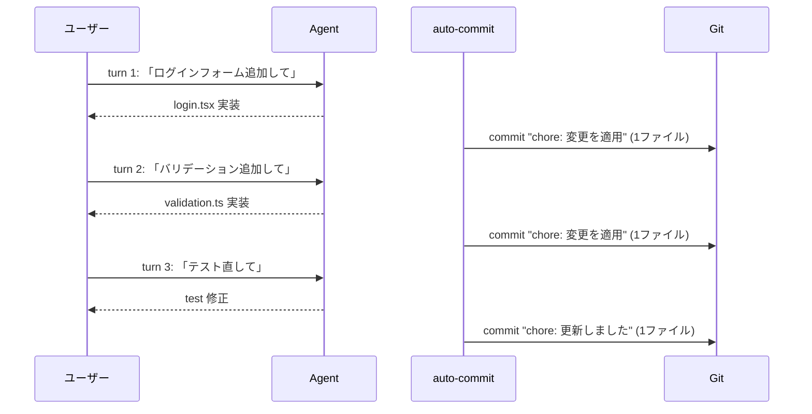
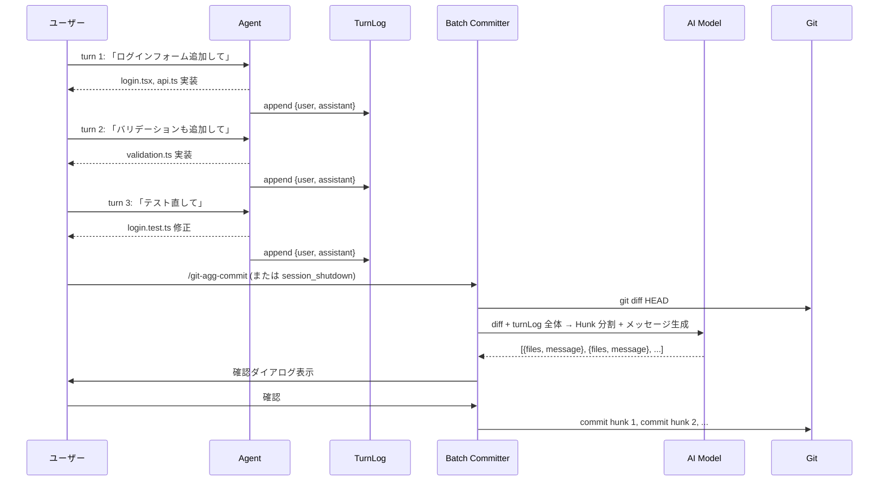

# Design: メッセージログ蓄積 + バッチ Hunk コミット

## 1. 問題定義

### 現状

`auto-commit`（`agent_end` ハンドラ）は毎ターン終了時に発火し、**1 つの Conventional Commit メッセージ**を生成して**全変更を 1 コミット**する。



### 問題点

| 問題 | 詳細 |
|------|------|
| **会話的プロンプトがコミットメッセージに不向き** | 「〜して」「〜追加して」は指示であり、コミットメッセージではない |
| **1 会話 = 1 コミットの粒度が不自然** | 3 ターンに跨る 1 つの機能追加が、バラバラのコミットに |
| **Hunk 分割なし** | 複数ファイルの変更が 1 つの汎用メッセージに丸められる |
| **汎用メッセージが頻出** | 「変更を適用」「更新しました」など |

### 根本原因

`agent_end` のタイミングでは**十分なコンテキストが蓄積されていない**。ユーザーの真の意図（「ログイン機能を追加する」）は複数ターンに分散しており、単一ターンからは抽出できない。

---

## 2. 提案アーキテクチャ

### コンセプト

**メッセージログをセッション中に蓄積**し、コミット実行時に**全ログ + 最終 diff** から AI が Hunk 分割とメッセージ生成を行う。



### 生成されるコミット例

```
feat(auth): ログインフォームを追加 (auth/login.tsx, auth/api.ts)
feat(auth): バリデーションを追加 (auth/validation.ts)
fix(auth): ログインテストの失敗を修正 (auth/login.test.ts)
```

---

## 3. コンポーネント設計

### 3.1 TurnLog（新規モジュール）

```typescript
// src/core/turn-log.ts

interface TurnEntry {
  /** Turn index (1-based) */
  index: number;
  /** User's raw message (truncated to ~500 chars) */
  userMessage: string;
  /** Assistant's first meaningful response excerpt (~300 chars) */
  assistantExcerpt: string;
  /** Files changed during this turn (from git status snapshots, optional) */
  filesChanged?: string[];
}

class TurnLog {
  private entries: TurnEntry[] = [];
  private turnIndex = 0;

  /** Called from agent_end handler */
  append(event: AgentEndEvent, changedFiles: string[]): void {
    this.turnIndex++;
    const userMsg = extractLastUserMessage(event.messages) ?? "";
    const assistantExcerpt = extractAssistantExcerpt(event.messages) ?? "";

    this.entries.push({
      index: this.turnIndex,
      userMessage: userMsg.slice(0, 500),
      assistantExcerpt: assistantExcerpt.slice(0, 300),
      filesChanged: changedFiles.slice(0, 20),
    });
  }

  /** Serialize for AI prompt injection */
  formatForPrompt(): string {
    if (this.entries.length === 0) return "(no conversation log)";

    return this.entries
      .map(
        (e) =>
          `[Turn ${e.index}]\n` +
          `  User: ${e.userMessage}\n` +
          `  Assistant: ${e.assistantExcerpt}\n` +
          (e.filesChanged?.length
            ? `  Files: ${e.filesChanged.join(", ")}\n`
            : ""),
      )
      .join("\n");
  }

  clear(): void {
    this.entries = [];
    this.turnIndex = 0;
  }
}
```

**設計意図**:
- セッションスコープのインメモリデータ（永続化不要）
- コミット実行後にクリア
- 各エントリは 1KB 以下 → 50 ターンでも 50KB 以内

### 3.2 BatchCommitter（新規モジュール）

```typescript
// src/core/batch-committer.ts

async function batchCommit(
  pi: ExtensionAPI,
  ctx: ExtensionContext,
  turnLog: TurnLog,
): Promise<BatchCommitResult> {
  // 1. 変更チェック
  if (!(await hasChanges(pi))) {
    return { committed: 0, message: "no changes" };
  }

  // 2. Diff 収集（既存の collectDiff を再利用）
  await footerManager.setPhase("collectDiff");
  const diff = await collectDiff(pi, ctx.cwd);
  if (diff === null || !diff.trim()) {
    return { committed: 0, message: "no diff" };
  }

  // 3. TurnLog を注入した拡張プロンプトで Hunk 分割
  await footerManager.setPhase("analyze");
  const hunks = await analyzeDiffWithContext(pi, ctx, diff, turnLog);

  // 4. Hunk 後処理
  const processed = processHunks(hunks);
  if (processed.length === 0) {
    return { committed: 0, message: "no hunks" };
  }

  // 5. 確認ダイアログ（既存の ReviewOverlay を流用）
  const confirmed = await showBatchConfirmDialog(ctx, processed);
  if (!confirmed) {
    return { committed: 0, message: "cancelled" };
  }

  // 6. シーケンシャルコミット（既存の commitHunks を流用）
  const result = await commitHunks(pi, ctx, processed);

  // 7. TurnLog クリア
  turnLog.clear();

  return result;
}
```

### 3.3 拡張プロンプト（diff-analyzer.ts の拡張）

既存の `diffAnalyzer.systemPrompt` と `buildPrompt` を拡張し、TurnLog を注入する：

```typescript
// 新しいプロンプトビルダー
function buildPromptWithContext(
  diff: string,
  turnLogText: string,
  lang: string,
): string {
  return (
    `=== CONVERSATION LOG ===\n` +
    `The following is the full conversation that led to the changes below.\n` +
    `Use it to understand the INTENT behind each change.\n\n` +
    `${turnLogText}\n\n` +
    `=== GIT DIFF ===\n` +
    `Split this diff into logical hunks. Each hunk should correspond to\n` +
    `a distinct intent from the conversation log above.\n\n` +
    `\`\`\`diff\n${diff}\n\`\`\`\n\n` +
    `Return ONLY a JSON array of hunks.`
  );
}
```

**拡張システムプロンプトのポイント**:
- TurnLog を「意図のヒント」として提供
- diff が**主軸**（最終的な変更の真実は diff にある）
- TurnLog は**補助**（なぜその変更をしたかのコンテキスト）
- この設計により、AI は「ターン 1 の会話 → login.tsx の変更」「ターン 2 の会話 → validation.ts の変更」と正しく相関付けられる

---

## 4. 統合ポイント

### 4.1 既存コードの変更

| ファイル | 変更内容 | 影響度 |
|----------|----------|--------|
| `src/core/turn-log.ts` | **新規追加** | — |
| `src/core/batch-committer.ts` | **新規追加** | — |
| `src/index.ts` | `session_start` で TurnLog 初期化、`agent_end` で append | 小 |
| `src/core/auto-commit.ts` | auto-commit の即時コミットを設定で切り替え可能に | 中 |
| `src/core/diff-analyzer.ts` | `analyzeDiffWithContext()` を追加（TurnLog 注入版） | 中 |
| `src/commands/agg-commit.ts` | `/git-agg-commit` が TurnLog を使うよう変更 | 中 |
| `src/utils/settings.ts` | `auto_agg_commit_mode` 設定追加 | 小 |
| `src/i18n/messages.ts` | 新規プロンプト用の i18n キー追加 | 小 |

### 4.2 設定

```toml
# pi-git.toml
auto_agg_commit = true
auto_agg_commit_mode = "batch"   # "immediate" | "batch"
```

| 値 | 動作 |
|----|------|
| `"immediate"` | 従来通り、毎ターン agent_end で即時コミット |
| `"batch"` (default) | agent_end では TurnLog 蓄積のみ。コミットは `/git-agg-commit` または `session_shutdown` で一括実行 |

### 4.3 イベントフック

```
session_start   → new TurnLog()
agent_end       → turnLog.append(event, changedFiles)
                   if mode === "immediate": 即時コミット（既存動作）
                   if mode === "batch": 何もしない
session_shutdown → if mode === "batch" && dirty: batchCommit()
/git-agg-commit → batchCommit() を実行し、TurnLog クリア
```

---

## 5. UI / UX

### 5.1 確認ダイアログ

既存の `ReviewOverlay`（`src/core/review.ts`）を流用。各 hunk に「どのターンの会話から来たか」のヒントを表示：

```
── Hunk レビュー ──────────────────────────────
▶ [✓] 2 files  feat(auth): ログインフォームを追加
  [✓] 1 files  feat(auth): バリデーションを追加
  [✓] 1 files  fix(auth): ログインテスト修正

  [ コミット (3件) ]

  Space:除外  e:編集  j/k:移動  Esc:キャンセル
```

### 5.2 Footer 表示

batch モードでは footer に蓄積状況を表示：

```
auto-commit: batch (3 turns logged) | 5 files changed
```

---

## 6. エッジケース

| ケース | 対応 |
|--------|------|
| **TurnLog が空** | diff のみで Hunk 分割（従来の `/git-agg-commit` と同じ動作） |
| **TurnLog が巨大（100+ ターン）** | 直近 20 ターン + 古いターンの要約を注入 |
| **session_shutdown 前に手動コミット済み** | TurnLog クリア済み → diff 空 → 何もしない |
| **batch モード中に /git-agg-commit 手動実行** | TurnLog を使って batch コミットし、TurnLog クリア |
| **会話中に git 操作（手動 stash/rebase 等）** | TurnLog の `filesChanged` が diff と不一致になる可能性 → diff を主軸にするので許容 |
| **No user messages（headless）** | TurnLog 空 → 従来の diff-only 分析にフォールバック |

---

## 7. 移行パス

1. **Phase 1**: TurnLog + batch-committer を実装。`auto_agg_commit_mode = "batch"` を新デフォルトに
2. **Phase 2**: `/git-agg-commit` が TurnLog を使うよう変更
3. **Phase 3**: `session_shutdown` フック追加（将来的）
4. **Phase 4** (optional): ヒューリスティック自動判定（N ターン変更なし + dirty tree）

---

## 8. 未解決の質問

1. **`session_shutdown` での自動コミット**：Phase 3 で対応。長いセッションでの変更溜まりすぎリスクがあるため、Phase 1-2 では `/git-agg-commit` の明示的実行を前提とする

2. **TurnLog のファイル相関の精度**：AI が diff と会話ログを正しく相関付けられるか？→ 小規模な実験で検証が必要

3. **`immediate` モードの存続**：ユーザーによっては即時コミットを好む可能性 → 設定で残す

4. **既存の `generateAutoCommitMessage` の扱い**：batch モードでは未使用になるが、immediate モード用に維持

---

## 9. 実装順序（推奨）

| Step | 内容 | 新規ファイル | 変更ファイル |
|------|------|-------------|-------------|
| 1 | `TurnLog` クラス実装 | `src/core/turn-log.ts` | — |
| 2 | `index.ts` に TurnLog 統合（session_start で初期化、agent_end で append） | — | `src/index.ts` |
| 3 | `analyzeDiffWithContext()` 実装 | — | `src/core/diff-analyzer.ts` |
| 4 | `batch-committer.ts` 実装 | `src/core/batch-committer.ts` | — |
| 5 | `auto_agg_commit_mode` 設定追加 | — | `src/utils/settings.ts`, `src/commands/config.ts` |
| 6 | `/git-agg-commit` を batch モード対応 | — | `src/commands/agg-commit.ts` |
| 7 | auto-commit.ts に mode 分岐追加 | — | `src/core/auto-commit.ts` |
| 8 | i18n（新規プロンプトキー）追加 | — | `src/i18n/messages.ts` |
