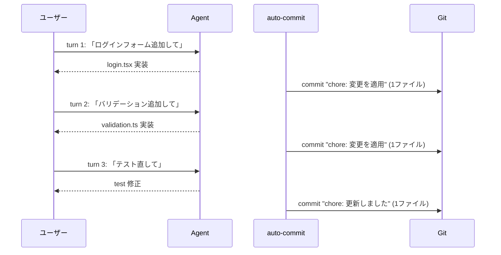
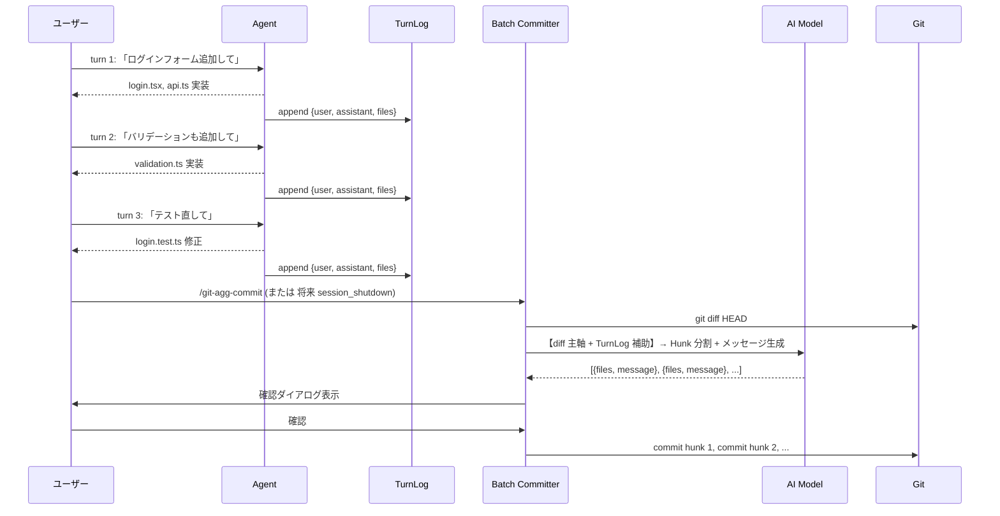

# Design: メッセージログ蓄積 + バッチ Hunk コミット

> **Status**: Phase 1 実装完了 (2026-06-13)。auto-commit は削除し `/git-agg-commit` に一本化。
> **実装済み**: TurnLog, batch-committer, /git-agg-commit TurnLog 統合
> **削除済み**: per_turn 即時コミット, auto-commit 確認ダイアログ, 単一コミットメッセージ生成
> **未実装**: Phase 2 (確認ダイアログ TurnLog 抜粋表示), Phase 3 (session_shutdown 自動コミット)

## 1. 問題定義

### 現状

`auto-commit`（`agent_end` ハンドラ）は毎ターン終了時に発火し、**1 つの Conventional Commit メッセージ**を生成して**全変更を 1 コミット**する。



### 問題点

| 問題 | 詳細 |
|------|------|
| **会話的プロンプトがコミットメッセージに不向き** | 「〜して」「〜追加して」は指示であり、コミットメッセージではない |
| **1 会話 = 1 コミットの粒度が不自然** | 複数ターンに跨る 1 つの機能追加が、バラバラのコミットに |
| **Hunk 分割なし** | 複数ファイルの変更が 1 つの汎用メッセージに丸められる |
| **汎用メッセージが頻出** | 「変更を適用」「更新しました」など |

### 根本原因

`agent_end` のタイミングでは**十分なコンテキストが蓄積されていない**。ユーザーの真の意図（「ログイン機能を追加する」）は複数ターンに分散しており、単一ターンからは抽出できない。

---

## 2. 提案アーキテクチャ

### コンセプト

**メッセージログをセッション中に蓄積**し、コミット実行時に**全ログ + 最終 diff** から AI が Hunk 分割とメッセージ生成を行う。



### 生成されるコミット例

```
feat(auth): ログインフォームを追加 (auth/login.tsx, auth/api.ts)
feat(auth): バリデーションを追加 (auth/validation.ts)
fix(auth): ログインテストの失敗を修正 (auth/login.test.ts)
```

---

## 3. コンポーネント設計

### 3.1 TurnLog（新規モジュール `src/core/turn-log.ts`）

```typescript
/** 1 ターン分の会話ログエントリ */
interface TurnEntry {
  /** Turn index (1-based) */
  index: number;
  /** User's message — tail-truncated to ~500 chars */
  userMessage: string;
  /** Assistant's first meaningful excerpt — ~300 chars */
  assistantExcerpt: string;
  /** Files changed during this turn (from git diff --name-only). REQUIRED. */
  filesChanged: string[];
}

class TurnLog {
  private entries: TurnEntry[] = [];
  private turnIndex = 0;

  /** Maximum entries kept in the log (older entries dropped) */
  static readonly MAX_ENTRIES = 20;
  /** Maximum serialized TurnLog bytes for AI prompt budget */
  static readonly MAX_CHARS = 8_000;

  append(event: AgentEndEvent, changedFiles: string[]): void {
    this.turnIndex++;

    // User message: extract the LAST meaningful user message (newest-first)
    const userMessages = collectMessagesByRole(event.messages ?? [], "user");
    const userMsg = userMessages[0] ?? "";

    // Assistant excerpt: extract first assistant response with conversational fluff stripped
    const assistantMessages = collectMessagesByRole(event.messages ?? [], "assistant");
    const assistantMsg = assistantMessages[0] ?? "";

    this.entries.push({
      index: this.turnIndex,
      // Tail truncation: last 500 chars (most recent instruction is at the end)
      userMessage: tailTruncate(stripConversationalMarkers(userMsg), 500),
      // Head truncation: first 300 chars (assistant summary is typically at the start)
      assistantExcerpt: stripConversationalMarkers(assistantMsg).slice(0, 300),
      // Per-turn file snapshot (MANDATORY for AI correlation)
      filesChanged: changedFiles.slice(0, 20),
    });

    // Enforce budget: keep most recent entries
    if (this.entries.length > TurnLog.MAX_ENTRIES) {
      this.entries = this.entries.slice(-TurnLog.MAX_ENTRIES);
    }
  }

  /** Serialize for AI prompt injection. Returns "" when empty. */
  formatForPrompt(): string {
    if (this.entries.length === 0) return "";

    const lines: string[] = [];
    let totalChars = 0;

    // Most recent entries first (recency matters more)
    for (const e of [...this.entries].reverse()) {
      const block = [
        `### Turn ${e.index}`,
        `User: ${e.userMessage}`,
        `Assistant: ${e.assistantExcerpt}`,
        e.filesChanged.length
          ? `Files: ${e.filesChanged.join(", ")}`
          : "",
      ]
        .filter(Boolean)
        .join("\n");

      if (totalChars + block.length > TurnLog.MAX_CHARS) break;
      lines.push(block);
      totalChars += block.length + 1; // +1 for newline
    }

    return lines.join("\n\n");
  }

  get turnCount(): number {
    return this.entries.length;
  }

  get totalFilesChanged(): number {
    const allFiles = new Set<string>();
    for (const e of this.entries) {
      for (const f of e.filesChanged) allFiles.add(f);
    }
    return allFiles.size;
  }

  clear(): void {
    this.entries = [];
    this.turnIndex = 0;
  }
}
```

**設計上の決定事項**:
- `filesChanged` は**必須フィールド**。毎ターン `git diff --name-only` で確実に取得する
- ユーザーメッセージは**末尾切捨て**（ユーザーは先頭にエラーログ、末尾に指示を書く傾向がある）
- アシスタントメッセージは**先頭切捨て**（冒頭に作業サマリーが来る）
- 会話的マーカー（「〜してください」「承知しました」等）は切り捨て前に除去
- 50 ターン以上のセッションでは直近 20 エントリのみ保持
- シリアライズ出力は 8KB 上限（AI プロンプト予算保護）
- TurnLog は `immediate` / `accumulate` 両モードで作成する（`/git-agg-commit` のコンテキストに使うため）

### 3.2 共有ユーティリティの抽出

TurnLog のために、`auto-commit-message.ts` から以下の関数を共有モジュールに抽出する：

```typescript
// src/utils/message-utils.ts (新規)

/** Collect all messages of a given role, newest first */
export function collectMessagesByRole(
  messages: SimpleMessage[],
  role: string,
): string[] { /* ... existing implementation from auto-commit-message.ts ... */ }

/** Extract text content from message content (handles string | array) */
export function extractTextContent(content: string | unknown): string { /* ... */ }

/** Tail-truncate text to maxChars, keeping whole words */
export function tailTruncate(text: string, maxChars: number): string { /* ... */ }

/** Strip Japanese conversational markers from text */
export function stripConversationalMarkers(text: string): string { /* ... */ }
```

### 3.3 `commitHunks()` の共有化

`src/commands/agg-commit.ts` の private 関数 `commitHunks` を抽出：

```typescript
// src/core/commit-hunks.ts (新規)

export async function commitHunks(
  pi: ExtensionAPI,
  ctx: ExtensionCommandContext,
  hunks: Hunk[],
): Promise<{
  committed: number;
  failed: number;
  skipped: number;
  aborted: number;
}> { /* ... existing implementation from agg-commit.ts ... */ }
```

### 3.4 `analyzeDiff()` の拡張（`src/core/diff-analyzer.ts`）

新規関数を作らず、既存の `analyzeDiff()` を拡張する：

```typescript
export async function analyzeDiff(
  _pi: ExtensionAPI,
  ctx: ExtensionContext,
  diff: string,
  langOverride?: string,
  turnLogText?: string,  // NEW: optional TurnLog context
): Promise<Hunk[]>
```

`turnLogText` が提供された場合、`buildPromptWithContext(diff, turnLogText, lang)` を使う。空文字列の場合は既存の `buildPrompt(diff, lang)` と同じ動作。

**バッチ分割時の TurnLog 部分送信**: 8 ファイルを超えるバッチ分割時、各バッチのファイルセットに関連する TurnLog エントリのみを部分送信する（全 TurnLog を全バッチに送らない）。

### 3.5 拡張プロンプト

#### システムプロンプト（新規 i18n キー: `diffAnalyzer.systemPromptWithContext`）

```
Split git diff into logical hunks. Use the conversation log to understand
the INTENT behind each change, but the DIFF is always the primary truth source.

Priority order:
1. Diff structure (what actually changed in files)
2. File co-location patterns (which files change together)
3. TurnLog Files field (per-turn file correlation)
4. TurnLog conversation text (intent hints)

Rules:
- Each hunk = single logical change
- A single change may span multiple conversation turns — do NOT enforce 1-turn = 1-hunk
- If the conversation log is unclear or conflicts with the diff, the diff always wins
- If a file appears in the diff but not in any TurnLog entry, do not force-fit it to a turn
- When a file was modified across multiple turns, prefer the most recent turn

FORBIDDEN messages (NEVER generate):
- chore: apply changes / 変更を適用
- chore: update files / ファイルを更新
- Any message whose subject appears nowhere in the GIT DIFF
- Generic verbs without specific file/feature references

Good examples:
→ feat(auth): add login form
→ fix(payment): add null check in processor

Return ONLY a JSON array. No explanations or code fences.
```

#### ユーザープロンプト（新規 i18n キー: `diffAnalyzer.buildPromptWithContext`）

```
=== GIT DIFF (PRIMARY — this is what actually changed) ===
```diff
{diff}
```

=== CONVERSATION LOG (supplementary — use only to infer intent) ===
{turnLogText}

Split the diff above into logical hunks. Use the conversation log ONLY to
understand WHY changes were made, not to override the diff structure.
```

**プロンプト設計のポイント**:
- **diff が先、TurnLog が後** — AI の primacy bias を diff 側に寄せる
- TurnLog が空の場合はセクション全体を省略（ノイズ削減）
- 「diff が常に優先」「TurnLog と diff が矛盾したら diff が勝つ」を明示
- 汎用メッセージの禁止事項を明記（`autoCommitMsg.systemPrompt` の禁止リストを移植）
- 「1 ターン = 1 hunk ではない」ことを明示（複数ターンに跨る論理的変更を許容）

### 3.6 `processHunks()` に汎用メッセージ検出を追加

```typescript
// In processHunks() in diff-analyzer.ts
export function processHunks(hunks: Hunk[]): Hunk[] {
  const sanitized = hunks.map(sanitizeHunk);
  const seenFiles = new Set<string>();
  return sanitized
    .map((hunk) => {
      // NEW: check for generic messages and regenerate
      let message = hunk.message;
      if (isGenericMessage(message)) {
        message = generateFallbackMessage(hunk.files);
      }
      return { ...hunk, message };
    })
    .map((hunk) => ({
      ...hunk,
      files: hunk.files.filter((f) => {
        if (seenFiles.has(f)) return false;
        seenFiles.add(f);
        return true;
      }),
    }))
    .filter((hunk) => hunk.files.length > 0);
}
```

---

## 4. 統合ポイント

### 4.1 既存コードの変更

| ファイル | 変更内容 | 影響度 |
|----------|----------|--------|
| `src/core/turn-log.ts` | **新規追加** — TurnLog クラス | — |
| `src/utils/message-utils.ts` | **新規追加** — `collectMessagesByRole`, `extractTextContent`, `tailTruncate`, `stripConversationalMarkers` | — |
| `src/core/commit-hunks.ts` | **新規追加** — `commitHunks()` の抽出 | — |
| `src/core/batch-committer.ts` | **新規追加** — バッチコミットフロー | — |
| `src/index.ts` | `session_start` で TurnLog 初期化、`agent_end` で `turnLog.append()` | 小 |
| `src/core/auto-commit.ts` | モード分岐追加。`accumulate` モードでは TurnLog 蓄積のみ | 中 |
| `src/core/diff-analyzer.ts` | `analyzeDiff()` に `turnLogText?: string` 追加。`processHunks()` に汎用検出追加 | 中 |
| `src/core/auto-commit-message.ts` | `collectMessagesByRole`, `extractTextContent` を `message-utils.ts` に抽出 | 小 |
| `src/commands/agg-commit.ts` | `commitHunks` を `commit-hunks.ts` に抽出。TurnLog 利用対応 | 中 |
| `src/utils/settings.ts` | `auto_agg_commit_mode`, `batch_warn_turns` 設定追加 | 小 |
| `src/commands/config.ts` | 新規設定キーのバリデーション追加 | 小 |
| `src/utils/footer-manager.ts` | `setBatchStatus(turns, files)` メソッド追加 | 小 |
| `src/i18n/messages.ts` | 新規プロンプト・footer・設定説明の i18n キー追加 | 小 |

### 4.2 設定

```toml
# pi-git.toml
auto_agg_commit = true
auto_agg_commit_mode = "per_turn"   # "per_turn" | "accumulate"
batch_warn_turns = 5                # このターン数以上で通知
```

| 値 | 動作 |
|----|------|
| `"per_turn"` (default) | 従来通り、毎ターン agent_end で即時コミット |
| `"accumulate"` | agent_end では TurnLog 蓄積のみ。コミットは `/git-agg-commit` で一括実行（将来: `session_shutdown` で確認付き自動コミット） |

**レビュー決定事項**: Phase 1 では `"per_turn"` をデフォルトに維持。`session_shutdown` フックが利用可能になった Phase 3 で `"accumulate"` へのデフォルト切り替えを検討する。

### 4.3 イベントフック

```
session_start   → new TurnLog()
agent_end       → turnLog.append(event, changedFiles)
                   if mode === "per_turn": 即時コミット（既存動作）
                   if mode === "accumulate":
                     - TurnLog 蓄積のみ
                     - footer 更新（蓄積カウンター）
                     - batch_warn_turns 超過で通知
/git-agg-commit → batchCommit() を実行し、TurnLog クリア
(将来) session_shutdown
                → if mode === "accumulate" && dirty:
                    「N turns pending. Commit? [Y/n]」確認 → batchCommit()
```

---

## 5. UI / UX

### 5.1 Footer 表示

```
# per_turn モード（既存）
auto-commit: on (changed)

# accumulate モード（変更なし）
auto-commit: accumulate (0 turns) | clean

# accumulate モード（変更あり、閾値未満）
auto-commit: accumulate (3 turns) | 5 files

# accumulate モード（閾値超過）
⚠ auto-commit: accumulate (7 turns) | 12 files

# accumulate モード（重大超過）
!! auto-commit: accumulate (15 turns) | 28 files — run /git-agg-commit
```

視覚的インジケーター: 文字色が使えない端末でも ⚠ / !! プレフィックスで警告レベルを表現。

### 5.2 蓄積警告通知

`batch_warn_turns`（デフォルト 5）を超えたターンで、`agent_end` 時に 1 回だけ notify を表示：

> "5 ターンの未コミット変更が蓄積されています。/git-agg-commit でコミットしてください。"

通知は一度表示したら、TurnLog がクリアされるまで再表示しない。

### 5.3 確認ダイアログ

既存の `ReviewOverlay`（`src/core/review.ts`）を流用。Phase 1 では TurnLog 抜粋表示なし。Phase 2 で `d`（details）キーによる詳細表示を追加予定。

```
── Hunk レビュー ──────────────────────────────
▶ [✓] 2 files  feat(auth): ログインフォームを追加
  [✓] 1 files  feat(auth): バリデーションを追加
  [✓] 1 files  fix(auth): ログインテスト修正

  [ コミット (3件) ]

  Space:除外  e:編集  j/k:移動  Esc:キャンセル
```

### 5.4 モード切替時の通知

`auto_agg_commit_mode` を `"per_turn"` → `"accumulate"` に切り替えた際に通知：

> "accumulate モードでは、変更はターンごとに蓄積されます。コミットするには /git-agg-commit を実行してください。"

### 5.5 確認ダイアログの相互排他

| ダイアログ | 使用タイミング | コンポーネント |
|-----------|--------------|--------------|
| `ConfirmOverlay` | `per_turn` モードの agent_end 時 | `auto-commit-confirm.ts`（全画面） |
| `ReviewOverlay` | `/git-agg-commit --review`、または accumulate モードのコミット時 | `review.ts`（70% オーバーレイ） |

両者は**相互排他**なコードパスで呼ばれるため、同時表示の心配はない。

---

## 6. エッジケース

| ケース | 対応 |
|--------|------|
| **TurnLog が空** | プロンプトから会話ログセクションを省略。既存の diff-only 分析と同一動作 |
| **TurnLog が巨大（50+ ターン）** | 直近 20 エントリに制限。シリアライズ出力は 8KB 上限 |
| **手動 commit や reset で diff が減った** | diff を主軸にするため、存在しない変更に対応する hunk はファイル 0 になりスキップ。会話ログの `filesChanged` と diff の不一致は許容 |
| **accumulate モードで /git-agg-commit 手動実行** | TurnLog を使って batch コミットし、TurnLog クリア |
| **TurnLog エントリ内の `filesChanged` が累積的** | 毎ターンの `git diff --name-only` は前回コミット以降の累積変更を返す。AI は diff（最終状態）を主軸にするため許容 |
| **No user messages（headless）** | TurnLog 空 → 既存の diff-only 分析にフォールバック |
| **セッション切り替え** | TurnLog はセッションスコープのインメモリデータ。セッション切替で新規作成 |
| **2 つの同時セッション（同一リポジトリ）** | 各セッションが独立した TurnLog を持つ。正しい動作 |
| **`agent_end` 発火時に `/git-agg-commit` 実行中** | `footerManager.isRunning()` チェックで TurnLog.append をスキップ |

---

## 7. 移行パス

### Phase 1（MVP）: TurnLog + accumulate モード（opt-in）

- TurnLog クラス実装
- `analyzeDiff()` 拡張（turnLogText パラメータ）
- `commitHunks()` の共有モジュール抽出
- `batch-committer.ts` 実装
- `auto_agg_commit_mode` 設定追加（デフォルト `"per_turn"`）
- Footer 拡張（accumulate モード用カウンター）
- 蓄積警告通知（`batch_warn_turns` 閾値）
- プロンプト順序修正（diff 優先）
- 汎用メッセージ検出を hunk パイプラインに追加

### Phase 2: 品質・UX 強化

- 確認ダイアログに TurnLog 詳細表示（`d` キー）
- TurnLog 予算上限のチューニング
- ユーザーメッセージ抽出精度の改善
- バッチ分割時の TurnLog 部分フィルタ

### Phase 3: 自動化（`session_shutdown` フック利用可能後に）

- `session_shutdown` で確認付き自動コミット
- デフォルトモードの `"accumulate"` への切り替え検討
- `"per_turn"` モードの deprecation 検討

### Phase 4（optional）: ヒューリスティック自動判定

- N ターン変更なし + dirty tree で自動コミット判定

---

## 8. 未解決の質問

1. **`session_shutdown` フックの実装時期**: pi のプラットフォーム API に依存。Phase 3 はブロックされる可能性がある

2. **AI 相関精度**: diff の各部分がどの TurnLog エントリに対応するかの推論精度は、実験による検証が必要。現状の緩和策（diff 主軸、filesChanged 必須、優先順位ルール）で実用レベルの精度を期待

3. **`per_turn` モードの将来**: accumulate モードが安定したら `per_turn` を deprecate するか、両方を維持するか

4. **TurnLog の per-turn diff スナップショット**: 毎ターン `git diff` を保存すればファイル相関精度が向上するが、stash 操作のオーバーヘッドと orphan stash リスクが増加する。現時点では見送り

---

## 9. 実装チェックリスト

### Phase 1

- [ ] `src/utils/message-utils.ts` — `collectMessagesByRole`, `extractTextContent`, `tailTruncate`, `stripConversationalMarkers` 抽出
- [ ] `src/core/turn-log.ts` — TurnLog クラス
- [ ] `src/core/commit-hunks.ts` — `commitHunks()` 抽出
- [ ] `src/core/diff-analyzer.ts` — `analyzeDiff()` に `turnLogText?` 追加、`processHunks()` に汎用検出追加
- [ ] `src/i18n/messages.ts` — 新規 i18n キー（`diffAnalyzer.systemPromptWithContext`, `diffAnalyzer.buildPromptWithContext`, `footer.autoCommit.accumulate`, 他）
- [ ] `src/utils/settings.ts` — `auto_agg_commit_mode`, `batch_warn_turns` 追加
- [ ] `src/commands/config.ts` — 新規キーのバリデーション追加
- [ ] `src/core/batch-committer.ts` — バッチコミットフロー
- [ ] `src/utils/footer-manager.ts` — `setBatchStatus(turns, files)` 追加
- [ ] `src/core/auto-commit.ts` — モード分岐（per_turn / accumulate）
- [ ] `src/commands/agg-commit.ts` — TurnLog 利用 + `commitHunks` インポート先変更
- [ ] `src/core/auto-commit-message.ts` — 抽出した関数の import 先変更
- [ ] `src/index.ts` — TurnLog 初期化・append 統合
